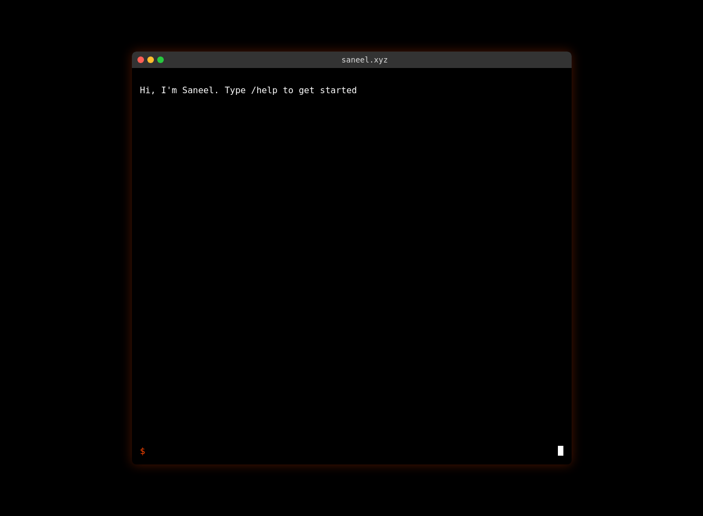

# Saneel.xyz CLI Interface Demo

This document demonstrates the functionality of the CLI interface for saneel.xyz.

## Initial Screen

When you first visit the website, you'll see a terminal-like interface with a welcome message and a blinking cursor:

## Command Functionality

The CLI interface supports the following commands:

### `/help`
Lists all available commands in a dropdown menu:
- `/help` - List available commands
- `/work` - Display work information
- `/content` - Display content information
- `/fun` - Display fun and other information
- `/clear` - Clear the terminal
- `/about` - About this CLI interface

### `/work`
Displays Saneel's work information with clickable links to:
- LinkedIn profile
- Ritual (current work)
- Accomplice (investing)
- Previous experience at Alkimiya, Dragonfly, Polychain
- UC Berkeley M.E.T. program

### `/content`
Shows content Saneel has published with links to:
- Twitter profile
- Open Alchemy
- Reorg defense analysis and talk
- Blockcrunch Recap episodes
- Fractional auction mechanism design

### `/fun`
Displays personal information:
- Location (NYC, SF, HK, SG)
- Interests (backgammon, DJing, tennis/padel, horology, F1/rally)
- Contact information

### `/clear`
Clears the terminal screen, returning to a clean state.

### `/about`
Displays information about the CLI interface itself.

## Interactive Experience

The interface features:
- A blinking cursor that indicates where you'll type
- Command history that shows previously entered commands
- Preserved hyperlinks from the original website
- Responsive design that works on both desktop and mobile devices
- Terminal-like styling with the original website's color scheme (black background, white text, orangered links)
